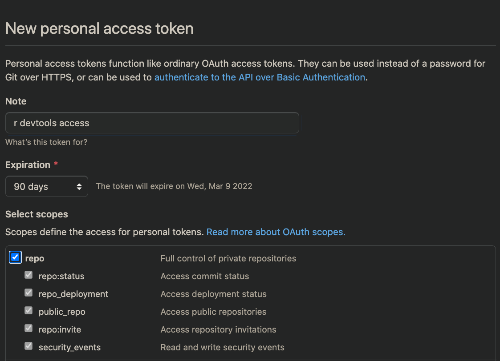

# thriver 

The aim of **thriver** is to make interacting with the Thrive API easy for R users

# Installation

### Prerequisites

**thriver** is currently hosted in a private repo. You must generate a 
GitHub Personal Access Token (PAT) for access.

Navigate to
https://github.com/settings/tokens

Create a PAT



Set the PAT key with rstudioapi::askForPassword()
```r
github_pat <<- rstudioapi::askForPassword()
```

### Install

```r
devtools::install_github("insilica/thriver",auth_token=github_pat)
```

# Usage

You will need to request an API key to access the Thrive API. 


