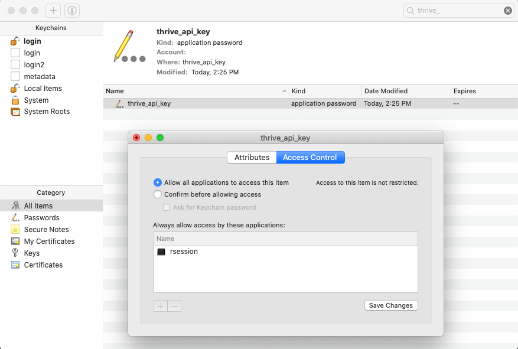

# thriver 

The aim of **thriver** is to make interacting with the Thrive API easy for R users

# Installation

```r
devtools::install_github("insilica/thriver")
```

# Usage

You will need to request an API key to access the Thrive API. 
On your first request, you will be prompted for your API key.

If you accidentally set it to the wrong value, you can always
```r
set_thrive_api_key()
```

**Note:** On macOS you may need to set permissions on your
thrive_api_key in Keychain Access

### File Handling

You will need the patient id and be a provider in their practice.
Get a list of files associated with the patient

```r
> get_patient_file_list(893)
<graphql_query>
List of 1
 $ data:List of 1
  ..$ Patient:List of 1
  .. ..$ files:List of 1
  .. .. ..$ :List of 3
  .. .. .. ..$ filename: chr "TCGA.PRAD.mutect.deca36be-bf05-441a-b2e4-394228f23fbe.DR-10.0.somatic.case_id.75a7afb5-66d5-47e3-8a8a-3e3a1e749a96.maf"
  .. .. .. ..$ url     : chr "https://thriveapp.health/files/patient/893/12f7193b-e81e-4eef-8fdb-c683d21de3ce/TCGA.PRAD.mutect.deca36be-bf05-"| __truncated__
  .. .. .. ..$ uuid    : chr "12f7193b-e81e-4eef-8fdb-c683d21de3ce"
```  

Get the maf file to generate a PDF report
```r
> thriver::get_file("https://thriveapp.health/files/patient/893/12f7193b-e81e-4eef-8fdb-c683d21de3ce/TCGA.PRAD.mutect.deca36be-bf05-441a-b2e4-394228f23fbe.DR-10.0.somatic.case_id.75a7afb5-66d5-47e3-8a8a-3e3a1e749a96.maf","TCGA.PRAD.mutect.deca36be-bf05-441a-b2e4-394228f23fbe.DR-10.0.somatic.case_id.75a7afb5-66d5-47e3-8a8a-3e3a1e749a96.maf")
[1] "/Users/james/Insilica/test-thriver/TCGA.PRAD.mutect.deca36be-bf05-441a-b2e4-394228f23fbe.DR-10.0.somatic.case_id.75a7afb5-66d5-47e3-8a8a-3e3a1e749a96.maf"
```

Upload the PDF report
```r
> thriver::post_file(893,"~/Insilica/test-thriver/Gene_Report.pdf")
$success
[1] TRUE
```

Report is present in the patient's file list
```r
> thriver::get_patient_file_list(893)
<graphql_query>
List of 1
 $ data:List of 1
  ..$ Patient:List of 1
  .. ..$ files:List of 2
  .. .. ..$ :List of 3
  .. .. .. ..$ filename: chr "TCGA.PRAD.mutect.deca36be-bf05-441a-b2e4-394228f23fbe.DR-10.0.somatic.case_id.75a7afb5-66d5-47e3-8a8a-3e3a1e749a96.maf"
  .. .. .. ..$ url     : chr "https://thriveapp.health/files/patient/893/12f7193b-e81e-4eef-8fdb-c683d21de3ce/TCGA.PRAD.mutect.deca36be-bf05-"| __truncated__
  .. .. .. ..$ uuid    : chr "12f7193b-e81e-4eef-8fdb-c683d21de3ce"
  .. .. ..$ :List of 3
  .. .. .. ..$ filename: chr "Gene_Report.pdf"
  .. .. .. ..$ url     : chr "https://thriveapp.health/files/patient/893/9fb27254-9ad8-4b67-bc99-4c43cd3a990e/Gene_Report.pdf"
  .. .. .. ..$ uuid    : chr "9fb27254-9ad8-4b67-bc99-4c43cd3a990e"
```

That report was incorrect, delete it!
```r
> thriver::delete_file(893,"9fb27254-9ad8-4b67-bc99-4c43cd3a990e")
$success
[1] TRUE
```

Chaos averted, order restored
```r
> thriver::get_patient_file_list(893)
<graphql_query>
List of 1
 $ data:List of 1
  ..$ Patient:List of 1
  .. ..$ files:List of 1
  .. .. ..$ :List of 3
  .. .. .. ..$ filename: chr "TCGA.PRAD.mutect.deca36be-bf05-441a-b2e4-394228f23fbe.DR-10.0.somatic.case_id.75a7afb5-66d5-47e3-8a8a-3e3a1e749a96.maf"
  .. .. .. ..$ url     : chr "https://thriveapp.health/files/patient/893/12f7193b-e81e-4eef-8fdb-c683d21de3ce/TCGA.PRAD.mutect.deca36be-bf05-"| __truncated__
  .. .. .. ..$ uuid    : chr "12f7193b-e81e-4eef-8fdb-c683d21de3ce"
```

### graphql_query

Outside of file handling, the Thrive API is accessed through graphql endpoints.
You can view the API documentation in your favorite GraphQL IDE using the 
header format:

```
Header Name:  "Authorization"
Header Value: "Bearer <thrive_api_key>"
```

There are a few basic functions included in this package, but if you need to do 
something more complicated you can always make a custom query call:

```r
thriver::graphql_query("{Profile {providerId verifiedEmails}}")
#> <graphql_query>
#> List of 1
#> $ data:List of 1
#> ..$ Profile:List of 2
#> .. ..$ providerId    : int 18
#> .. ..$ verifiedEmails:List of 1
#> .. .. ..$ : chr "james@insilica.co"
```

thriver::graphql_query() returns an S3 graphql_query object 

```r
structure(
    list(
      content = parsed, # Parsed reponse body JSON as a list
      response = resp, # Raw response
    ),
    class = "graphql_query"
  )
```

# Developer Notes

generate documentation
```r
devtools::document()
```

load for testing locally
```r
remotes::install_local("/Users/james/Insilica/thriver", build_vignettes = TRUE)
library("thriver", lib.loc="~/Insilica/thriver")
```
